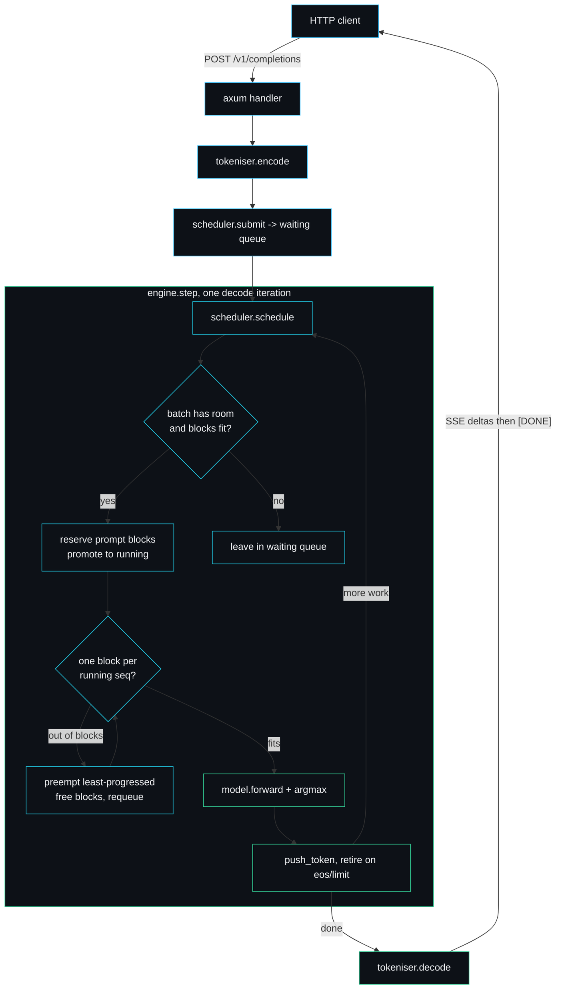

A minimal LLM inference server with a real paged KV-cache, continuous batching and speculative decoding.

[](LICENSE)


```rust
// The whole serving stack hangs off one trait. The model is the boring part.
pub trait Model: Send + Sync {
    fn forward(&self, context: &[TokenId]) -> StepLogits;
    // vocab_size, num_layers, eos_token ...
}
```

That four-line trait is the seam. Above it sit the three systems that actually decide how fast an inference server runs: a block-paged KV-cache, an iteration-level batching scheduler, and a draft-then-verify speculative decoder. Below it sits a model. In a production engine the model is a stack of attention layers on a GPU. Here it is a deterministic hash, on purpose, so the systems above the seam can be read, tested and benchmarked without a single CUDA kernel in sight.

## Why I built this

I kept hitting the same wall when I tried to learn how vLLM-style serving works. The PagedAttention paper sketches the idea in a few diagrams. The real engines implement it under tens of thousands of lines of CUDA and Python glue, where the scheduling logic is tangled up with kernel launches and memory pools. And the tutorials that promise to explain it quietly mock out the bit that matters: they call paging a "block table" and then never evict anything, or they "batch" requests that all happen to be the same length.

I wanted the middle. So I wrote the cache allocator, the scheduler and the speculative decoder for real, with the awkward cases handled (out-of-blocks preemption, resume, the rejection-sampling acceptance test), and I deliberately made the model trivial. The model being a deterministic `TinyTransformer` is not a shortcut I am apologising for, it is the point: the build finishes in a couple of seconds, the tests never flake, and every benchmark number is reproducible to the token on any machine with no GPU. The serving stack is the deliverable. The model is a placeholder you swap out by implementing one method.

## Request lifecycle



## The three systems

**Paged KV-cache** (`src/paged_cache.rs`, `PagedKVCache`). Memory is split into fixed-size blocks; each sequence carries a block table of the physical blocks holding its tokens. Blocks are allocated lazily, one at a time, so external fragmentation disappears entirely and internal waste is bounded by `block_size - 1` slots per sequence. `append` is transactional: it pre-checks the free count and returns `OutOfBlocks { needed, free }` without touching state, which is what lets the scheduler preempt and retry safely.

**Continuous batching** (`src/scheduler.rs`, `Scheduler::schedule`). A scheduling decision every decode iteration, not every batch. Each call admits what fits, reserves one block per running sequence, preempts the least-progressed sequences when blocks run out (recompute-based, never deadlocks), runs the decode batch, and retires anything that hit eos or its limit. It returns a plain `StepPlan` value and never calls the model, which is why the whole policy is unit-testable without a forward pass.

**Speculative decoding** (`src/speculative.rs`, `SpeculativeDecoder::step`). A cheap draft model proposes `k` tokens; the target verifies the run and accepts each with probability `min(1, p/q)`, resampling on the first rejection. The output is provably identical to plain target decoding, which the test `speculative_output_matches_plain_target_decoding` checks token for token. A fully accepted run of `k` drafts emits `k + 1` tokens for one target step.

## Run it

```bash
git clone https://github.com/sarmakska/forge-infer && cd forge-infer
cargo test                                   # 37 tests across the serving stack
cargo run --release --bin forge-infer        # serves 127.0.0.1:8080 (set FORGE_ADDR to change)
```

```bash
# native shape
curl -s localhost:8080/generate -d '{"prompt":"hello forge","max_tokens":24}'

# OpenAI-compatible, streamed over SSE
curl -sN localhost:8080/v1/completions -d '{"prompt":"stream me","max_tokens":20,"stream":true}'
```

Existing OpenAI client code can point `base_url` at forge-infer and call `/v1/completions` unchanged, including `stream: true`.

## Numbers

Measured with `cargo run --release --bin forge-bench` on an Apple M3 Pro (macOS 25.3, Rust 1.96), workload fixed at 64 requests, 16-token prompts, 64 max new tokens. The deterministic model is near-free, so these figures isolate the cost of the serving machinery rather than model compute. That is deliberate and it is the only honest thing this benchmark can measure without a GPU.

| strategy | tokens/sec | ms/request | notes |
| --- | ---: | ---: | --- |
| sequential (batch=1) | ~1.88M | 0.031 | static-batching baseline, fresh engine per request |
| continuous batching (batch=16) | ~2.07M | 0.028 | 64 requests share one engine loop |
| speculative (lookahead=4) | ~0.59M | 0.10 | acceptance 52%, output exact |

Read these for shape, not magnitude. With a near-free model the continuous-vs-sequential gap (around 1.1x here) is mostly scheduler overhead; the win only grows large once the model forward pass is the expensive part, because keeping the batch full then dwarfs the bookkeeping. The figure that carries across to a real model is the **52% acceptance rate**: just over half the draft's proposals are reused without a target recompute, and each accepted token skips a target step. Numbers drift a few percent run to run with machine load.

## Design decisions

A few choices where I picked one road and not the obvious other:

- **Recompute-based preemption, not KV swapping to host memory.** vLLM offers both: when blocks run out it can either drop a sequence and re-prefill it later (recompute) or copy its KV blocks out to CPU memory and back (swap). Swap saves the recompute but adds a copy path, a host memory pool and a second eviction policy. For a teaching engine the recompute path is the one worth showing: it is a dozen lines, it provably never deadlocks because freeing a sequence releases at least the blocks the step needs, and it makes the cost of preemption legible. I rejected swapping because it would double the cache's surface area to demonstrate a latency optimisation that only matters once the model is real.

- **A deterministic hash model, not a real tiny transformer in `candle` or `tch`.** I could have pulled in `candle` and run an actual small attention model. I did not, for two reasons. First, the acceptance test in speculative decoding needs `p(t)/q(t)` to be exactly reproducible, and floating-point attention across two model instances is not bit-stable enough to assert on. Second, a real model would put a multi-second compile and a heavy dependency tree between a reader and the code they came to read. The hash model is a pure function of the context, which is precisely the property the cache, scheduler and decoder need to be verified deterministically.

- **A `StepPlan` value returned from the scheduler, not the scheduler calling the model directly.** The tempting shape is one `tick()` that schedules and runs the forward pass together. I split them so `schedule()` mutates only the cache and the queues and hands back a description of what to run. That is what makes `preempts_when_blocks_run_out` and `admission_blocks_when_prompt_does_not_fit` assertable with no model in the test at all. The cost is one extra indirection in the engine loop, which I will pay every time for a testable policy.

## Limitations and non-goals

This is not a production inference server and it is not pretending to be one.

- The model generates a reproducible byte stream, not language. There are no real weights, no attention maths and no GPU kernels. If you want prose out, implement `Model::forward` against your own weights.
- The HTTP layer spins up a fresh `Engine` per request over a shared `Arc<dyn Model>`. That keeps the example readable but means concurrent requests do not yet share one long-lived engine loop on the server side; the continuous-batching path is exercised by the benchmark, which drives 64 requests through a single engine.
- KV state is recomputed from the full context on each `forward` rather than carried across calls. A real backend would attend over the physical blocks `PagedKVCache::block_table` hands it.
- Greedy argmax decoding only. No temperature, top-p or top-k sampling on the server path.

## Roadmap

What I intend to add, and what I will not.

- **Will add:** a single shared server-side engine loop so live HTTP traffic gets real continuous batching, not just the benchmark; prefix sharing across sequences with copy-on-write block tables (the next natural use of a block table); a `candle` feature flag behind the `Model` trait for anyone who wants real text out.
- **Will not add:** distributed or multi-GPU serving, a model zoo, or a web UI. The repository is about three serving algorithms read end to end. Scope creep would bury the thing it exists to teach.

## Documentation

Full write-ups live in the [wiki](https://github.com/sarmakska/forge-infer/wiki): Architecture and Design Decisions; a page per subsystem (Paged KV-Cache, Continuous Batching, Speculative Decoding, Engine, Model and Tokeniser, HTTP Server); and reference and operations pages (API Reference, Configuration and Tuning, Benchmarks, Testing Strategy, Security Model, Writing a Model Backend, Examples and Recipes, Comparisons, FAQ, Troubleshooting, Roadmap and Limitations). The wiki pages are also mirrored under [`wiki/`](wiki) in the repository.

## Licence

MIT. See [LICENSE](LICENSE).

---
Built by Sarma. Part of the SarmaLinux open-source line.
Website: https://sarmalinux.com  .  GitHub: https://github.com/sarmakska
