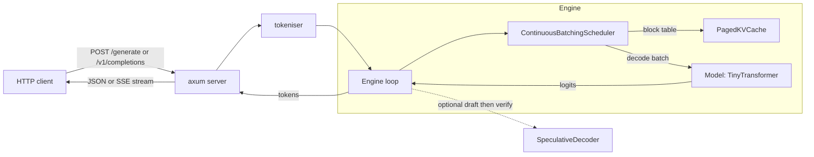

# forge-infer

A minimal LLM inference server that implements the real serving techniques: paged KV-cache, continuous batching and speculative decoding.

[](LICENSE)


forge-infer is a teaching-grade LLM serving engine I wrote in Rust to show the systems that make inference fast, with the difficult parts built for real rather than mocked. It runs against a small fixed-weight deterministic transformer so the whole thing builds in seconds and the tests never flake, but the block-based KV-cache allocator, the iteration-level continuous batching scheduler and the draft-then-verify speculative decoder are the genuine algorithms a production engine uses. If you have ever wanted to read a clean, tested implementation of how vLLM-style serving actually works, this is that, without the CUDA.

## Architecture



The request lifecycle in words: a request arrives, is tokenised, and joins the scheduler's waiting queue. Every iteration the scheduler admits what fits, reserves one KV block per running sequence, preempts the least progressed sequences if blocks run out, runs a batched decode step through the model, and retires sequences that hit their stop condition. Tokens stream back to the client as Server-Sent Events.

## Quickstart

```bash
# 1. clone and enter
git clone https://github.com/sarmakska/forge-infer && cd forge-infer

# 2. run the test suite (paged cache, scheduler, speculative decoder, HTTP)
cargo test

# 3. start the server
cargo run --release --bin forge-infer        # listens on 127.0.0.1:8080

# 4. ask for a completion (native shape)
curl -s localhost:8080/generate -d '{"prompt":"hello forge","max_tokens":24}'

# 5. stream an OpenAI-shaped completion over SSE
curl -sN localhost:8080/v1/completions -d '{"prompt":"stream me","max_tokens":20,"stream":true}'
```

Run the benchmark with `cargo run --release --bin forge-bench`.

## What is in the box

- **PagedKVCache** (`src/paged_cache.rs`): block-based KV allocation with a per-sequence block table, lazy growth, allocate and free, bounded internal fragmentation, zero external fragmentation, an out-of-blocks signal and a largest-sequence eviction policy.
- **ContinuousBatchingScheduler** (`src/scheduler.rs`): iteration-level scheduling, admission control, decode batching across sequences, and recompute-based preemption when blocks run out, with resume.
- **SpeculativeDecoder** (`src/speculative.rs`): a draft-then-verify loop with the standard rejection-sampling acceptance test, exact-output guarantee, and correct fallback on rejection.
- **HTTP server** (`src/server.rs`): an axum server exposing `POST /generate`, an OpenAI-compatible `POST /v1/completions` with SSE streaming, and `GET /healthz`.
- **forge-bench** (`src/bin/bench.rs`): measures tokens per second and latency for sequential, continuous-batching and speculative strategies and prints a table.
- A small deterministic `TinyTransformer` behind a `Model` trait, plus a reversible byte-level tokeniser, so the engine is fully reproducible without heavy ML dependencies.

## When to use this, and when not to

Use it to learn how a modern inference server is built, to read tested reference implementations of paging, continuous batching and speculative decoding, or as a skeleton to graft a real model backend onto behind the `Model` trait.

Do not use it to serve a real model in production. The model here is a deterministic stand-in chosen to keep the build fast and the tests reproducible; there are no GPU kernels, no real weights and no attention maths. The value is the serving stack around the model, not the model.

## Benchmarks

Measured on this machine with the deterministic model (64 requests, 16-token prompts, 64 max new tokens). The absolute throughput reflects scheduling overhead rather than GPU kernels, which is exactly the point: the benchmark isolates the serving techniques.

| strategy | tokens/sec | ms/request | notes |
| --- | --- | --- | --- |
| sequential (batch=1 baseline) | ~1.76M | 0.033 | one request at a time |
| continuous batching (batch=16) | ~1.91M | 0.030 | requests share decode steps |
| speculative (lookahead=4) | ~0.40M | 0.143 | acceptance rate 52% |

The speculative acceptance rate of around 52% is the headline metric: just over half of the cheap draft model's proposals are accepted by the target without a recompute, and the output is provably identical to plain target decoding.

## Documentation

Full write-ups live in the [wiki](https://github.com/sarmakska/forge-infer/wiki): Architecture, Paged-KV-Cache, Continuous-Batching, Speculative-Decoding, Benchmarks and Troubleshooting.

## Licence

MIT. See [LICENSE](LICENSE).
