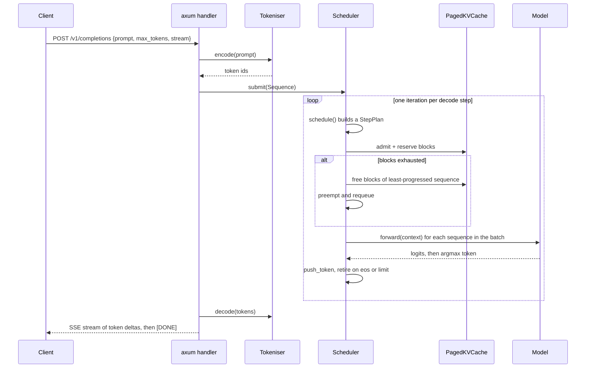

# Architecture

forge-infer is organised so that each serving technique lives in its own module with its own tests, and the model is a swappable trait. This page is the map.

## Module map

| Module | File | Responsibility |
| --- | --- | --- |
| `model` | `src/model.rs` | The `Model` trait and the deterministic `TinyTransformer`. |
| `tokeniser` | `src/tokeniser.rs` | Reversible byte-level encode and decode. |
| `paged_cache` | `src/paged_cache.rs` | Block-based KV-cache allocator and block tables. |
| `scheduler` | `src/scheduler.rs` | Continuous batching, admission, preemption. |
| `speculative` | `src/speculative.rs` | Draft-then-verify decoding with an acceptance test. |
| `engine` | `src/engine.rs` | The loop joining the scheduler to the model. |
| `server` | `src/server.rs` | The axum HTTP server and OpenAI-compatible endpoint. |

## The request lifecycle



## The decision that makes it testable

The scheduler and the engine are deliberately split. The scheduler decides **which** sequences run and **when** blocks are reserved, freed or preempted, and it returns those decisions as a plain `StepPlan` value. The engine is the only thing that calls the model's `forward`. This separation has two payoffs:

1. **The scheduling policy is unit-testable without a model or a GPU.** Tests in `src/scheduler.rs` construct a scheduler, submit sequences, call `schedule()`, and assert on the returned `StepPlan` and on the cache's block counts. There is no forward pass involved, so preemption and admission logic can be checked exactly.
2. **The model is swappable.** Because the engine talks to a `Model` trait, replacing the deterministic `TinyTransformer` with a real backend is a matter of implementing one method, `forward(&self, context: &[TokenId]) -> StepLogits`.

## Concurrency model

The server shares one `Arc<dyn Model>` across requests, so the model weights stay resident, and gives each request its own `Engine` with its own `PagedKVCache` and scheduler. That keeps the example readable. A production deployment would route all requests into a single long-lived engine loop so that the continuous batching scheduler can interleave decode steps across concurrent requests, which is exactly the loop `Engine::step` implements; the benchmark's continuous-batching path drives many requests through one engine to demonstrate it.

## The Model trait

```rust
pub trait Model: Send + Sync {
    fn vocab_size(&self) -> usize;
    fn num_layers(&self) -> usize;
    fn eos_token(&self) -> TokenId;
    fn forward(&self, context: &[TokenId]) -> StepLogits;
}
```

`StepLogits` carries the next-token logits and offers `argmax` for greedy decoding and `prob_of(token)` for the speculative acceptance test. The `TinyTransformer` maps a trailing context window through a splitmix-style hash to a peaked logits distribution. It is a pure function of the context, which is what lets the cache, the scheduler and the decoder be verified deterministically.
