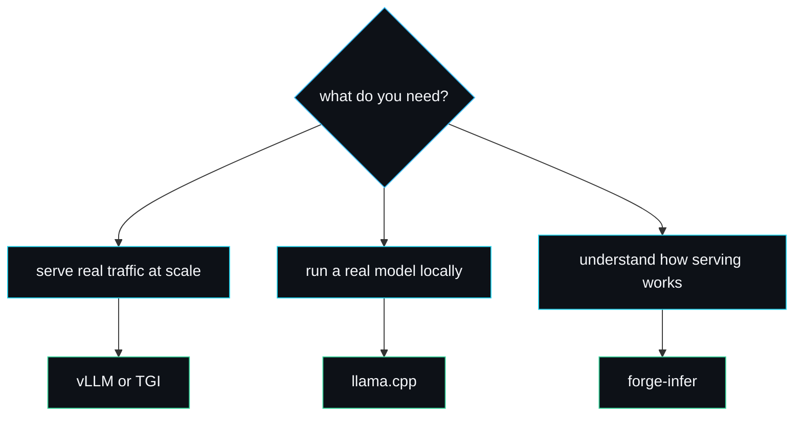

# Comparisons

forge-infer implements the same three core ideas as the production inference engines, but for a different purpose. This page sets it honestly against the obvious alternatives so you can pick the right tool. The short version: if you want to serve real traffic, use vLLM or TGI; if you want to read and understand how they work, read forge-infer.

## What forge-infer shares with the production engines

The paged KV-cache, continuous batching and speculative decoding are not forge-infer inventions. They are the techniques that vLLM popularised and that the rest of the field adopted. forge-infer implements all three with the awkward cases handled, which is the part tutorials usually skip. Where it differs from every production engine is the model: forge-infer's is a deterministic hash, not a stack of attention layers on a GPU.

## Against vLLM

[vLLM](https://github.com/vllm-project/vllm) is the reference production engine and the origin of PagedAttention.

| | vLLM | forge-infer |
| --- | --- | --- |
| Scale | tens of thousands of lines, C++/CUDA + Python | a few hundred readable Rust lines |
| Model | real weights on GPU | deterministic hash, CPU |
| Paged KV-cache | yes, with real attention kernels over blocks | yes, the allocator and block tables, no kernels |
| Continuous batching | yes, one shared engine loop | yes, in the engine and benchmark; per-request on the HTTP path |
| Preemption | recompute or KV swap to host | recompute only, by deliberate choice |
| Speculative decoding | yes, batched verification | yes, the acceptance test, verified position by position |
| Purpose | serve production traffic fast | read and understand the systems |

The point of comparison is not that forge-infer competes with vLLM; it does not. It is that forge-infer implements the same algorithms in a form you can read in an afternoon, with tests that pin the exact behaviour vLLM's kernels also rely on. If you have read the PagedAttention paper and want to see the allocator and scheduler as plain code, forge-infer is the bridge. The recompute-versus-swap choice is the one place forge-infer deliberately narrows vLLM's surface; the reasoning is on [Design-Decisions](Design-Decisions).

## Against Text Generation Inference (TGI)

[TGI](https://github.com/huggingface/text-generation-inference) is HuggingFace's Rust-and-Python serving stack. Like forge-infer it has a Rust core, which makes the comparison closer in language but not in scope. TGI is a full product: continuous batching, tensor parallelism, quantisation, a router, a launcher, observability. forge-infer is a single-author teaching engine with none of that surface. If you want a production Rust-backed server, use TGI; if you want to understand the batching scheduler at the heart of one, forge-infer's `Scheduler::schedule` is 100 lines you can hold in your head.

## Against llama.cpp

[llama.cpp](https://github.com/ggerganov/llama.cpp) is the go-to for running real models locally on CPU and consumer GPUs. It is the opposite trade-off from forge-infer: llama.cpp is all about the model (quantised real weights, fast CPU inference) and comparatively simple on the serving side, while forge-infer is all about the serving systems and trivial on the model side. They are complementary, not competing. A natural future for forge-infer would be a `Model` implementation that calls into a real backend; llama.cpp-style inference behind the trait is exactly the kind of extension [Writing-a-Model-Backend](Writing-a-Model-Backend) describes.

## Against a from-scratch tutorial

Most blog posts and tutorials that promise to explain vLLM-style serving take one of two shortcuts: they describe paging with a diagram and a `block_table` field that never evicts anything, or they "batch" requests that conveniently all have the same length so no preemption ever happens. forge-infer was built because I kept hitting those shortcuts (the "Why I built this" story is in the README). It handles the cases the tutorials skip: out-of-blocks preemption with resume, the transactional `append` that lets the scheduler retry safely, and the rejection-sampling acceptance test with its exactness guarantee. Those are the parts that are hard to get right, so those are the parts it tests.

## Against an OpenAI API endpoint

forge-infer exposes an OpenAI-compatible `/v1/completions` endpoint with SSE streaming, so existing OpenAI client code runs against it unchanged. The difference is everything behind the endpoint: OpenAI serves frontier models at scale with auth, billing and safety systems; forge-infer serves a deterministic byte stream from localhost with none of that. The compatibility exists so you can point a client at forge-infer to test plumbing, not to replace the API. See [HTTP-Server](HTTP-Server) and [Security-Model](Security-Model).

## When to use which

forge-infer is the answer to exactly one of these. It is honest about the other two.

## See also

- [Design-Decisions](Design-Decisions) for the choices that distinguish forge-infer from vLLM specifically.
- [Roadmap-and-Limitations](Roadmap-and-Limitations) for what forge-infer will and will not become.

---
SarmaLinux . sarmalinux.com . [forge-infer repository](https://github.com/sarmakska/forge-infer)
