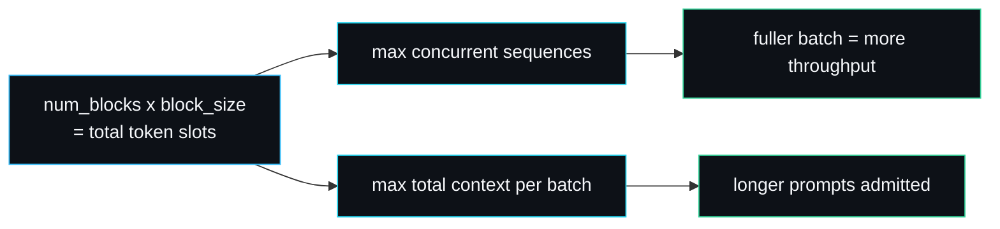

# Configuration and Tuning

forge-infer has a deliberately small set of knobs. There is no config file and no flag soup; the parameters that matter are constructor arguments and one environment variable. This page lists every knob, what it trades off, and how to set it for a few common goals.

## The knobs

| Knob | Where | Default | Controls |
| --- | --- | --- | --- |
| `num_blocks` | `PagedKVCache::new` | 512 (server), 2048 (bench continuous) | total KV memory, hence max concurrency and context length |
| `block_size` | `PagedKVCache::new` | 16 | granularity of allocation, internal fragmentation bound |
| `max_batch_size` | `SchedulerConfig` | 16 (server), 8 (default) | how many sequences decode at once |
| `lookahead` | `SpeculativeDecoder::new` | 4 (bench) | tokens drafted per speculative round |
| `max_new_tokens` | `Engine::submit` / per request | 32 (HTTP default) | generation length cap per request |
| `FORGE_ADDR` | environment | `127.0.0.1:8080` | server bind address |
| `RUST_LOG` | environment | `forge_infer=info` | tracing verbosity |

The server's defaults live in `default_state()` (`src/lib.rs`):

```rust
server::AppState {
    model: Arc::new(model),
    blocks: 512,
    block_size: 16,
    max_batch_size: 16,
}
```

To change them for the running server, edit `default_state` or build your own `AppState` and pass it to `server::router`.

## num_blocks: the memory budget

`num_blocks * block_size` is the total number of token slots the cache can hold. With the defaults that is `512 * 16 = 8192` slots, shared across all concurrent sequences. This single number decides two things at once: how many sequences you can run concurrently, and how long each can grow.



A prompt that needs more blocks than the cache holds can never be admitted (see the failure mode on [Continuous-Batching](Continuous-Batching)). If you serve long prompts, raise `num_blocks`. The cost is linear memory; in a real backend each block holds `block_size * num_layers * 2` key/value tensors, so the memory is real, not bookkeeping.

## block_size: granularity versus waste

`block_size` is the number of token slots per block. It trades allocator bookkeeping against internal fragmentation:

- **Larger blocks**: fewer allocator operations per sequence (a block lasts more tokens before the next pull), but more wasted slots in the final partially filled block. The waste per sequence is bounded by `block_size - 1`.
- **Smaller blocks**: tighter packing, but more block-table entries and more `append` calls.

A block size of 16 is a sensible middle that mirrors common production settings. The test `internal_fragmentation_is_bounded_by_block_size` confirms the waste bound holds. If your sequences are short and numerous, a smaller block size packs them tighter; if they are long and few, a larger block size cuts bookkeeping with negligible relative waste.

### A concrete sizing example

To run 16 concurrent sequences each up to 480 tokens with a block size of 16: each sequence needs `ceil(480/16) = 30` blocks, so `16 * 30 = 480` blocks minimum, plus headroom for prompts and preemption churn. The server default of 512 covers this with a little slack. Push to 1024 blocks if you want either more concurrency or longer contexts.

## max_batch_size: concurrency cap

`max_batch_size` caps how many sequences decode in one step. It interacts with `num_blocks`: a large batch size with too few blocks just means the scheduler preempts more, because it admits sequences it cannot keep resident. The two should be sized together. As a rule of thumb, `num_blocks` should comfortably hold `max_batch_size` sequences at your typical context length, or preemption churn will eat the throughput gain. The test `admits_up_to_batch_size` pins the cap behaviour.

## lookahead: speculative aggressiveness

`lookahead` is how many tokens the draft proposes per round. Larger lookahead means more tokens per fully accepted round, but more wasted draft work when a rejection comes early (every drafted token after the first rejection is discarded). The benchmark uses 4, a common production default. With a draft that agrees with the target three times in four, the expected accepted run length is short, so a very large lookahead mostly wastes draft passes. Tune it to your measured acceptance rate: higher acceptance rewards a longer lookahead. See [Speculative-Decoding](Speculative-Decoding) for the acceptance maths.

## Tuning for a goal

### Maximum throughput on many concurrent requests

Raise `max_batch_size` and `num_blocks` together so the batch stays full without churn. The benchmark's continuous path uses `max_batch_size = 16` and 2048 blocks for exactly this. With a real model, a full batch is where continuous batching earns its keep (see [Benchmarks](Benchmarks)).

### Lowest single-stream latency

Use speculative decoding with a draft that closely tracks your target, and tune `lookahead` to the acceptance rate you measure. Each accepted token skips a target forward pass, so latency falls in proportion to the acceptance rate.

### Long prompts

Raise `num_blocks` until the largest prompt you serve fits with room to grow. Keep `block_size` at 16 unless your prompts are unusually short.

### Tight memory

Lower `num_blocks`. Expect more preemption under load; the scheduler handles it correctly (it never deadlocks), but throughput drops as recompute churn rises. A smaller `block_size` reclaims a few slots of internal fragmentation per sequence.

## What you cannot configure (yet)

- **Sampling.** Decoding is greedy argmax on the server path; there is no temperature, top-p or top-k. This is a [Roadmap-and-Limitations](Roadmap-and-Limitations) item.
- **Server-side cross-request batching.** Each HTTP request gets its own engine today; one shared engine loop is the top roadmap item.
- **KV swap to host.** Preemption is recompute-only, a deliberate choice argued on [Design-Decisions](Design-Decisions).

## See also

- [Paged-KV-Cache](Paged-KV-Cache) for the memory model behind `num_blocks` and `block_size`.
- [Benchmarks](Benchmarks) for how these knobs move the numbers.
- [API-Reference](API-Reference) for the exact signatures.

---
SarmaLinux . sarmalinux.com . [forge-infer repository](https://github.com/sarmakska/forge-infer)
