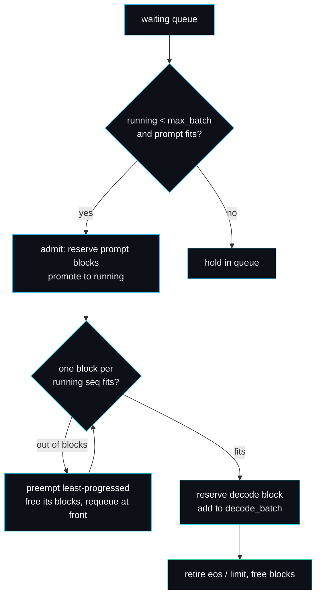

# Continuous Batching

Continuous batching is the scheduling technique that keeps an inference engine busy. This page explains what it is, why it beats static batching, and the exact decisions `Scheduler::schedule` in `src/scheduler.rs` makes on every iteration.

## Static versus continuous

**Static batching** collects a group of requests, runs the whole group to completion, and only then admits the next group. The flaw is obvious once you see it: requests in a batch finish at different times, but a short request cannot leave until the longest one in its batch is done. The slot it occupied sits idle, and new requests wait for the entire batch to drain.

**Continuous batching** makes a scheduling decision every single decode iteration. A sequence that emits its end-of-sequence token leaves the batch immediately, and a waiting request takes its place on the very next step. The batch is refilled continuously, so the engine stays saturated and tail latency drops.



## One iteration, step by step

Every call to `schedule()` performs four phases and returns a `StepPlan` describing what it decided.

### 1. Admission

While the running batch has room (under `max_batch_size`) and the cache can hold the next waiting request's tokens, pull it in. Admission reserves blocks for the request's full current length (prompt plus any output it already produced, which matters for resumed sequences). If the reservation fails, the admit is rolled back and admission stops for this step; the request waits.

```rust
while self.running.len() < self.config.max_batch_size {
    let id = next.id;
    self.cache.admit(id);
    match self.cache.append(id, tokens_to_place) {
        Ok(()) => { /* promote to running */ }
        Err(_) => { self.cache.free(id); break; }
    }
}
```

### 2. Block reservation for the decode step

Each running sequence needs room for one more token this step. The scheduler sums `blocks_needed_for(seq, 1)` across the batch and compares it to the free block count.

### 3. Preemption

If the batch needs more blocks than are free, the scheduler preempts. It repeatedly selects the **least progressed** running sequence (fewest output tokens, breaking ties towards the higher id), frees its blocks entirely, and moves it back to the front of the waiting queue. It keeps preempting until the remaining batch fits. This is **recompute-based preemption**: a preempted sequence keeps its output and re-prefills its prompt plus output when it is readmitted. It never deadlocks, because freeing a sequence always releases at least as many blocks as the step needs.

```rust
let victim_idx = self.running.iter().enumerate()
    .filter(|(_, s)| s.state == SeqState::Running)
    .min_by_key(|(_, s)| (s.output.len(), std::cmp::Reverse(s.id)))
    .map(|(i, _)| i);
```

### 4. Commit and retire

Reserve the decode block for each surviving running sequence and record it in `decode_batch`. Then retire any sequence that has hit its `max_new_tokens` limit, free its blocks, and list it in `finished`.

## Why preempt the least progressed sequence

Preempting the sequence with the least output minimises wasted recompute. A sequence that has produced two tokens loses two tokens of recompute when it resumes; one that has produced two hundred would lose two hundred. Evicting the youngest keeps total recompute low, the same intuition behind shortest-remaining-time scheduling. I chose recompute over swapping KV blocks to host memory deliberately; the [Roadmap](Roadmap-and-Limitations) and the README's design-decisions section explain that trade-off.

## A worked preemption

`preempts_when_blocks_run_out` runs this exact sequence on a tiny cache (6 blocks, block size 1, so every token costs a block):

1. Submit sequences 1 and 2, prompts of length 2 each. Admission uses 4 of 6 blocks. Both decode, needing 2 of the 2 free. No preemption.
2. Push one token to each. Now each holds 3 blocks, 6 of 6 used, 0 free.
3. Next `schedule()`: both want one more block, none are free. The scheduler preempts exactly one, the least-progressed by tie-break (sequence 2), frees its 3 blocks and requeues it. Sequence 1 decodes.
4. `preempted_sequence_resumes_later` then finishes sequence 1, frees its blocks, and shows sequence 2 readmitted and run to completion.

## End of sequence handling

When the engine produces an eos token it calls `push_token(id, token, is_eos: true)`, which caps the sequence's limit to its current output length. The next `schedule()` retires it. So eos retirement and length-limit retirement go through the same path, which `eos_retires_a_sequence_early` checks.

## How the engine drives it

```rust
pub fn step(&mut self) -> Vec<(u64, TokenId, bool)> {
    let plan = self.scheduler.schedule();
    for id in &plan.decode_batch {
        let context = /* prompt + output */;
        let token = self.model.forward(&context).argmax();
        let is_eos = token == self.model.eos_token();
        self.scheduler.push_token(*id, token, is_eos);
    }
    /* collect emitted tokens */
}
```

The benchmark's continuous-batching path submits 64 requests to one engine and drives this loop, demonstrating that requests genuinely share decode iterations rather than running one after another.

## What the tests prove

`admits_up_to_batch_size`, `batches_decode_across_sequences`, `preempts_when_blocks_run_out`, `preempted_sequence_resumes_later`, `admission_blocks_when_prompt_does_not_fit`, `finished_sequences_retire_and_free_blocks`, `eos_retires_a_sequence_early` and `idle_when_no_work`.

---
SarmaLinux . sarmalinux.com . [forge-infer repository](https://github.com/sarmakska/forge-infer)
