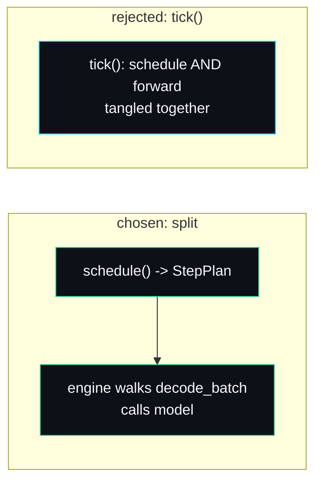

# Design Decisions

The strongest signal that a project was built by a person and not assembled from a template is that it can name the roads it did not take. This page collects the decisions where I picked one approach over an obvious alternative, and says why. Some of these also appear in the README's design section; here they get the full argument with code references.

## A deterministic hash model, not a real tiny transformer

**The alternative:** pull in `candle` or `tch` and run an actual small attention model so the engine produces something closer to language.

**What I chose:** a fixed-weight `TinyTransformer` (`src/model.rs`) that maps a trailing context window through a splitmix-style hash to a peaked logits distribution.

**Why.** Two reasons, and the first is decisive. The speculative decoder's acceptance test compares `p(t)` from the target with `q(t)` from the draft and accepts with probability `min(1, p/q)`. For the exactness test `speculative_output_matches_plain_target_decoding` to assert that speculative output equals plain decoding token for token, those probabilities have to be bit-for-bit reproducible across two model instances. Floating-point attention is not stable enough for that; reorderings and fused multiply-adds shift the low bits. A pure integer hash is exactly reproducible. The second reason is practical: a real model drags in a multi-second compile and a heavy dependency tree between a reader and the code they came to read. The hash keeps the build to a couple of seconds with no ML crates.

The hash gives the serving stack the three properties it needs: it is a pure function of the context (so caching is correct to verify), deterministic (so accept/reject is assertable), and cheap (so the benchmark stresses the scheduler, not CUDA). The model is the placeholder; the serving stack is the deliverable.

## Recompute-based preemption, not KV swapping to host memory

**The alternative:** when blocks run out, copy a sequence's KV blocks out to CPU memory and swap them back in when it resumes, instead of dropping and re-prefilling. vLLM offers both.

**What I chose:** recompute. When the scheduler preempts a sequence (`src/scheduler.rs`), it frees its blocks entirely and sends it back to the waiting queue, where it re-prefills its prompt plus output when readmitted.

**Why.** Swapping saves the recompute but adds a copy path, a host memory pool and a second eviction policy: it roughly doubles the cache's surface area. For a teaching engine, the recompute path is the one worth showing. It is about a dozen lines. It provably never deadlocks, because freeing a sequence releases at least as many blocks as the decode step needs, so there is always a victim whose eviction unblocks progress. And it makes the cost of preemption legible: a preempted sequence loses exactly its output length in recompute, which is why the scheduler preempts the least-progressed sequence (shortest-remaining-time intuition; see [Continuous-Batching](Continuous-Batching)). I rejected swapping because it would obscure the very thing the scheduler exists to teach, to demonstrate a latency optimisation that only matters once the model forward pass is genuinely expensive.

## A StepPlan value, not a scheduler that calls the model

**The alternative:** one `tick()` method that schedules the batch and runs the forward pass together.

**What I chose:** `Scheduler::schedule` returns a plain `StepPlan` describing what to run, and `Engine::step` is the only thing that ever calls `Model::forward`.

**Why.** The split is what makes `preempts_when_blocks_run_out` and `admission_blocks_when_prompt_does_not_fit` assertable with no model in the test at all. A scheduler test constructs a scheduler, submits sequences, calls `schedule()`, and asserts on the returned `StepPlan` and the cache's block counts. There is no GPU, no model, no forward pass to stand up. The cost is one extra indirection in the engine loop: `schedule()` returns the batch, then `step()` walks `decode_batch` calling the model. I pay that every time, for a policy I can test in isolation. A combined `tick()` would force every scheduler test to mock a model and would entangle two concerns that change for different reasons.

## A transactional append, not allocate-then-rollback

**The alternative:** `append` greedily pulls blocks as it goes and unwinds them if it runs out partway.

**What I chose:** `append` pre-checks the free count with `blocks_needed_for`, and only mutates state once it knows the allocation will succeed (`src/paged_cache.rs`). On `OutOfBlocks` the sequence is left completely untouched.

**Why.** The scheduler relies on a failed `append` being a no-op so it can preempt and retry without first having to clean up a half-grown sequence. The test `out_of_blocks_is_reported_and_leaves_state_intact` pins this: after a failed append the sequence length is unchanged and no blocks leaked. A rollback path would work but is more code and one more place for a bug; pre-checking is simpler and the check (`blocks_needed_for`) is needed by the scheduler anyway.

## A free list as a stack, not a queue

**The alternative:** a FIFO free list, handing out the oldest freed block first.

**What I chose:** a `Vec<BlockId>` used as a stack; `append` pops from the back, `free` pushes to the back.

**Why.** Popping the most recently freed block keeps recently touched memory hot, which is friendly to a real allocator's cache locality. It is a small thing and the comment in `PagedKVCache::new` says so plainly. The behaviour is otherwise identical for correctness; the test `no_external_fragmentation_after_interleaved_free` does not care about order, only that any free block satisfies any sequence.

## A reversible byte tokeniser, not a real BPE vocabulary

**The alternative:** ship a byte-pair or sentencepiece vocabulary so token boundaries look realistic.

**What I chose:** a byte-level codec where each byte is one token (`src/tokeniser.rs`).

**Why.** Tokenisation is orthogonal to the serving techniques this project teaches. A real BPE vocabulary would add a dependency and a data file and teach nothing about paging, batching or speculation. The byte codec is reversible (`decode(encode(text)) == text`), dependency-free, and good enough to demonstrate text in and text out over HTTP. When you plug in a real model you bring its tokeniser with it.

## Per-request engines on the server, not one shared loop (for now)

**The alternative:** route all HTTP traffic into a single long-lived engine loop so requests share decode iterations on the server side.

**What I chose, for now:** each request gets a fresh `Engine` over a shared `Arc<dyn Model>` (`AppState::new_engine`, `src/server.rs`).

**Why, and the caveat.** Per-request engines keep the example readable and isolate requests from each other's memory. But they mean the server does not yet get cross-request continuous batching; that runs only in the benchmark, which drives 64 requests through one engine. This is the one decision I am not fully happy with, which is why a single shared server-side loop is the top [Roadmap-and-Limitations](Roadmap-and-Limitations) item rather than a non-goal. `Engine::step` already implements the loop it would need.

## See also

- [Roadmap-and-Limitations](Roadmap-and-Limitations) for what follows from these decisions.
- [Comparisons](Comparisons) for how these choices line up against vLLM and others.

---
SarmaLinux . sarmalinux.com . [forge-infer repository](https://github.com/sarmakska/forge-infer)
