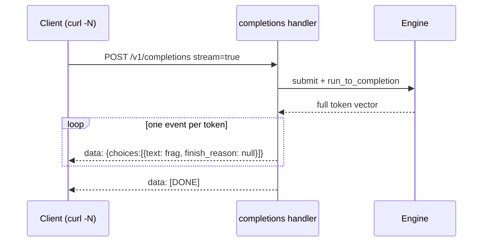

# HTTP Server

forge-infer ships a small axum HTTP server (`src/server.rs`, `src/main.rs`) that exposes three endpoints: a native completion shape, an OpenAI-compatible completion endpoint with Server-Sent Events streaming, and a liveness probe. This page documents the wire format of every endpoint, the request and response types, the streaming protocol, and the concurrency model behind the handlers. For the request lifecycle end to end see [Architecture](Architecture); for the full endpoint reference in table form see [API-Reference](API-Reference).

## Booting the server

`src/main.rs` is the binary entry point. It initialises tracing, reads the bind address from the `FORGE_ADDR` environment variable (default `127.0.0.1:8080`), builds the router over `default_state()`, and serves it.

```rust
let addr: SocketAddr = std::env::var("FORGE_ADDR")
    .unwrap_or_else(|_| "127.0.0.1:8080".to_string())
    .parse()?;
let app = server::router(default_state());
let listener = tokio::net::TcpListener::bind(addr).await?;
axum::serve(listener, app).await?;
```

`default_state()` (in `src/lib.rs`) builds the standard `AppState`: a `TinyTransformer` sized to the tokeniser vocabulary with six layers, 512 blocks of 16 token slots, and a max batch size of 16. Tracing respects `RUST_LOG`; with no env var set it defaults to `forge_infer=info`.

## AppState and per-request engines

```rust
pub struct AppState {
    pub model: Arc<dyn Model>,
    pub blocks: usize,
    pub block_size: usize,
    pub max_batch_size: usize,
}
```

`AppState` is cloned into every handler (axum requires `Clone` state), but the model is behind an `Arc`, so cloning the state is cheap and the weights are never copied. When a request arrives, the handler calls `AppState::new_engine()`, which builds a fresh `Engine` over the shared model and a brand-new `PagedKVCache`:

```rust
fn new_engine(&self) -> Engine {
    Engine::new(
        self.model.clone(),
        SchedulerConfig { max_batch_size: self.max_batch_size },
        PagedKVCache::new(self.blocks, self.block_size),
    )
}
```

This is the concurrency model and its one honest limitation. Sharing the model keeps the weights resident; giving each request its own cache and scheduler keeps the example readable and means requests cannot interfere with each other's memory. The cost is that concurrent HTTP requests do not share one long-lived engine loop, so the server side does not yet get cross-request continuous batching. The benchmark drives 64 requests through a single engine to demonstrate the batching that the server path will eventually use. Closing this gap is the top [Roadmap-and-Limitations](Roadmap-and-Limitations) item, and `Engine::step` already implements the loop it would need.

## The router

```rust
pub fn router(state: AppState) -> Router {
    Router::new()
        .route("/healthz", get(healthz))
        .route("/generate", post(generate))
        .route("/v1/completions", post(completions))
        .with_state(state)
}
```

`router` is kept separate from binding so the integration tests can mount the exact same router on an ephemeral port. That is why `tests/server_integration.rs` exercises the real handlers rather than a stub.

## GET /healthz

A liveness probe. Returns `{"status":"ok"}` with no work done. Used by the integration test `healthz_reports_ok` and suitable for a container readiness check.

## POST /generate

The native shape. Request:

```json
{ "prompt": "hello forge", "max_tokens": 24 }
```

`max_tokens` defaults to 32 if omitted (`default_max_tokens`). Response:

```json
{ "text": "...", "prompt_tokens": 11, "completion_tokens": 24 }
```

`prompt_tokens` is the encoded length of the prompt, `completion_tokens` the number of tokens generated. The handler calls `run_prompt`, which encodes the prompt, runs a fresh engine to completion, and decodes the output:

```rust
fn run_prompt(state: &AppState, prompt: &str, max_tokens: usize) -> (String, usize, usize) {
    let prompt_ids = tokeniser::encode(prompt);
    let mut engine = state.new_engine();
    engine.submit(1, prompt_ids.clone(), max_tokens);
    let outputs = engine.scheduler_mut_run(prompt_ids.len(), max_tokens);
    let text = tokeniser::decode(&outputs);
    (text, prompt_ids.len(), outputs.len())
}
```

## POST /v1/completions

The OpenAI-compatible shape. Existing OpenAI client code can point its `base_url` at forge-infer and call this endpoint unchanged, including `stream: true`. Request:

```json
{ "model": "forge-infer", "prompt": "the quick brown fox", "max_tokens": 16, "stream": false }
```

`model` defaults to `"forge-infer"`, `max_tokens` to 32, `stream` to false. Non-streaming response:

```json
{
  "id": "cmpl-forge",
  "object": "text_completion",
  "model": "forge-infer",
  "choices": [{ "text": "...", "index": 0, "finish_reason": "stop" }]
}
```

The `finish_reason` is always `"stop"` on the non-streaming path. The integration test `openai_completions_non_streaming` asserts on `object`, the `text` field and `finish_reason`.

## Server-Sent Events streaming

When `stream` is true the handler returns an SSE stream in the OpenAI delta shape. The implementation generates the whole completion up front (the model is deterministic and near-instant), then emits one event per token followed by the `[DONE]` sentinel:

```rust
for tok in tokens {
    let frag = tokeniser::decode_one(tok);
    let chunk = serde_json::json!({
        "id": "cmpl-forge",
        "object": "text_completion",
        "model": model,
        "choices": [{ "text": frag, "index": 0, "finish_reason": serde_json::Value::Null }],
    });
    events.push(Ok(Event::default().data(chunk.to_string())));
}
events.push(Ok(Event::default().data("[DONE]")));
```



Each non-sentinel event is a JSON chunk whose `finish_reason` is `null` until the stream ends. The wire format is genuine SSE: each event is a `data:` line. Because the model is near-instant the events arrive together; with a real model the per-token cost would space them out. The integration test `openai_completions_streams_sse` asserts the content type starts with `text/event-stream`, that there are at least two data events, that the stream ends with `[DONE]`, and that the first chunk parses as OpenAI-shaped JSON.

### Calling it from curl

```bash
curl -sN localhost:8080/v1/completions \
  -d '{"prompt":"stream me","max_tokens":20,"stream":true}'
```

The `-N` flag disables curl's buffering so you see the individual `data:` lines. Recipes for calling it from the OpenAI Python client are on [Examples-and-Recipes](Examples-and-Recipes).

## Endpoint summary

| Method | Path | Body | Returns |
| --- | --- | --- | --- |
| `GET` | `/healthz` | none | `{"status":"ok"}` |
| `POST` | `/generate` | `{prompt, max_tokens?}` | `{text, prompt_tokens, completion_tokens}` |
| `POST` | `/v1/completions` | `{prompt, max_tokens?, stream?, model?}` | OpenAI completion JSON, or SSE stream |

## Failure modes

- **Malformed JSON or a missing `prompt`.** axum's `Json` extractor rejects the body before the handler runs, returning a 4xx with a deserialisation error. `prompt` is the only required field.
- **A prompt larger than the cache.** The scheduler never admits it (see [Continuous-Batching](Continuous-Batching)); `run_to_completion` returns no output and the response carries an empty completion with `completion_tokens` 0 rather than an error. Raise `blocks` in `default_state` if you need longer prompts.
- **Port already in use.** Binding fails at startup and the process exits with the bind error. Set `FORGE_ADDR` to a free port.

## See also

- [API-Reference](API-Reference) for the full Rust and HTTP surface.
- [Engine](Engine) for what `scheduler_mut_run` does under the hood.
- [Security-Model](Security-Model) for the threat model of the HTTP layer.

---
SarmaLinux . sarmalinux.com . [forge-infer repository](https://github.com/sarmakska/forge-infer)
