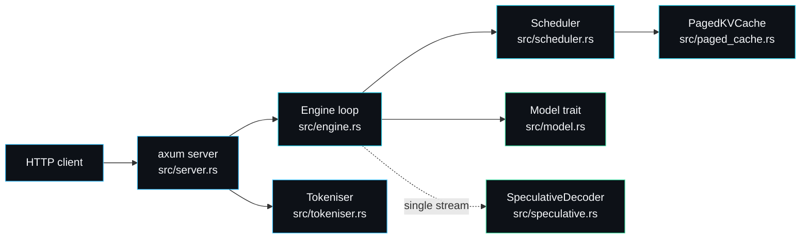

# forge-infer

A minimal LLM inference server with a real paged KV-cache, continuous batching and speculative decoding. The model is a deterministic stand-in so the serving systems can be read, tested and benchmarked without a GPU.

## Thirty-second orientation

A request arrives over HTTP, is tokenised, and joins a waiting queue. An engine loop runs one decode iteration at a time: a scheduler admits what fits, reserves KV blocks, preempts under pressure, runs a forward pass through the model, and retires finished sequences. Tokens stream back as Server-Sent Events. Three systems do the real work; the model is a one-method trait you swap out.



## The pages

This wiki is the complete documentation set. Start with Architecture, then the subsystem page for whatever you came to understand.

### Orientation and design

| Page | What it covers |
| --- | --- |
| [Architecture](Architecture) | Module map, request lifecycle, the split that makes the policy testable, concurrency model. |
| [Design-Decisions](Design-Decisions) | The roads not taken: hash model, recompute preemption, the StepPlan split, and more, each with the rejected alternative. |
| [Comparisons](Comparisons) | forge-infer set honestly against vLLM, TGI, llama.cpp and the typical tutorial. |
| [Roadmap-and-Limitations](Roadmap-and-Limitations) | What I will add, what I will not, and what this is not. |

### The subsystems

| Page | What it covers |
| --- | --- |
| [Paged-KV-Cache](Paged-KV-Cache) | Block allocation, why it kills fragmentation, the transactional `append`, a worked allocation. |
| [Continuous-Batching](Continuous-Batching) | Iteration-level scheduling, admission, preemption and resume, with the exact decision rules. |
| [Speculative-Decoding](Speculative-Decoding) | Draft-then-verify, the rejection-sampling acceptance test, the exactness proof-by-test. |
| [Engine](Engine) | The loop that joins the scheduler to the model, step by step, with its two entry points. |
| [Model-and-Tokeniser](Model-and-Tokeniser) | The `Model` trait, the deterministic `TinyTransformer`, the byte-level codec and its data format. |
| [HTTP-Server](HTTP-Server) | The axum endpoints, the OpenAI-compatible shape, the SSE streaming protocol. |

### Reference and operations

| Page | What it covers |
| --- | --- |
| [API-Reference](API-Reference) | Every public Rust symbol and the full HTTP surface, grouped by module. |
| [Configuration-and-Tuning](Configuration-and-Tuning) | Every knob, what it trades off, and how to set it for a goal. |
| [Benchmarks](Benchmarks) | What forge-bench measures, real numbers on Apple Silicon, how to read them honestly. |
| [Testing-Strategy](Testing-Strategy) | The 37 tests, how they are organised, and why determinism makes the hard parts testable. |
| [Security-Model](Security-Model) | The threat model, what is defended and what is not, and a hardening checklist. |
| [Writing-a-Model-Backend](Writing-a-Model-Backend) | Implementing `Model` against real weights and wiring the KV-cache through. |
| [Examples-and-Recipes](Examples-and-Recipes) | Copy-paste recipes over HTTP and as a Rust library. |
| [FAQ](FAQ) | Short answers to the questions people actually ask. |
| [Troubleshooting](Troubleshooting) | Concrete symptoms and fixes for build and runtime issues. |

## Try it now

```bash
cargo test                                   # 37 tests across the serving stack
cargo run --release --bin forge-infer        # serves 127.0.0.1:8080
cargo run --release --bin forge-bench        # prints the throughput table
```

```bash
curl -s localhost:8080/generate -d '{"prompt":"hello forge","max_tokens":24}'
curl -sN localhost:8080/v1/completions -d '{"prompt":"stream me","max_tokens":20,"stream":true}'
```

## The one simplification, stated plainly

Every component a real engine has is present and named the way the literature names it: a `Model` trait, a `PagedKVCache` with a block table, a `Scheduler` that returns a `StepPlan` each iteration, a `SpeculativeDecoder` with an acceptance test. The only thing faked is the model itself, a deterministic hash-based `TinyTransformer`. That keeps the build fast, the speculative acceptance test assertable, and every benchmark reproducible. To serve real text you implement `Model::forward` against your weights; nothing else in the stack changes. The reasoning is on [Design-Decisions](Design-Decisions), and the how-to is on [Writing-a-Model-Backend](Writing-a-Model-Backend).

---
SarmaLinux . sarmalinux.com . [forge-infer repository](https://github.com/sarmakska/forge-infer)
