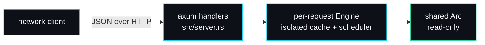

# Security Model

forge-infer is a teaching-grade project, not a hardened production server, and the [SECURITY.md](https://github.com/sarmakska/forge-infer/blob/main/SECURITY.md) policy says so. This page is the honest threat model: what the project defends against, what it does not, and what a deployment would have to add before exposing it.

## What forge-infer is for

A local engine for reading and benchmarking three serving algorithms. It binds to `127.0.0.1:8080` by default and ships a deterministic stand-in model. It is intended for learning and local experimentation, not for serving production traffic or untrusted input from the open internet.

## Trust boundaries

The one trust boundary is the HTTP edge. Everything inside the process is trusted. The model is shared read-only behind an `Arc`; each request gets its own cache and scheduler, so one request cannot read or corrupt another's KV state. That isolation is a side effect of the per-request-engine design (see [HTTP-Server](HTTP-Server)), not a hardening feature, but it is real.

## What the design defends against

- **Memory exhaustion from an oversized prompt.** A prompt that needs more blocks than the cache holds is never admitted; the scheduler rolls back the admit cleanly and the cache never leaks blocks (`admission_blocks_when_prompt_does_not_fit`). A single huge prompt cannot allocate unboundedly.
- **Runaway generation.** Every request carries a `max_new_tokens` cap, defaulting to 32 on the HTTP path. `run_to_completion` additionally guards at one million iterations so a pathological model cannot spin forever (`src/engine.rs`).
- **Malformed input crashing the process.** The axum `Json` extractor rejects bodies that do not deserialise into the request type, returning a 4xx before the handler runs. The cache's `append` returns typed errors rather than panicking on unknown sequences or exhaustion. Integer arithmetic in the cache and model uses `wrapping_*` and `div_ceil`, so it does not overflow-panic on large inputs.
- **Cross-request interference.** Per-request engines mean no shared mutable serving state between requests.

## What it does not defend against

This is the important half, stated plainly.

- **No authentication or authorisation.** Any client that can reach the port can submit prompts. There is no API key, no rate limit, no quota. Bind it to localhost and keep it there, or put a reverse proxy with auth in front.
- **No rate limiting or concurrency cap on connections.** Many simultaneous requests each spin up an engine; nothing bounds the total number of in-flight engines beyond the OS and tokio. A flood of concurrent requests is a denial-of-service vector. A production deployment needs a connection limit and a queue.
- **No TLS.** The server speaks plain HTTP. Terminate TLS at a reverse proxy.
- **No input sanitisation beyond JSON shape.** The prompt is bytes; it is encoded and fed to the model. There is no content filtering, because the model produces a byte stream, not language, and there is nothing to filter.
- **Untrusted model weights are out of scope.** The project supports its own deterministic model. Reports that depend on pointing the server at untrusted real weights are explicitly out of scope in SECURITY.md, because that is not a configuration the project supports. If you wire in a real backend, its safety is your responsibility.

## Dependency surface

The runtime dependency tree is small and well-known: `tokio`, `axum`, `serde`, `serde_json`, `futures`, `tracing` and `tracing-subscriber`. Tests additionally use `reqwest`. There are no native ML libraries, no FFI, and no `unsafe` blocks in the project's own code. A smaller dependency surface is a smaller attack surface, and keeping the model a pure-Rust hash is part of why the surface stays small. `Cargo.lock` is committed so builds are reproducible and auditable.

## Reporting a vulnerability

Email **security@sarmalinux.com** with a description, reproduction steps and impact. Do not open a public issue for a security problem. The policy commits to acknowledging a report within seven days. Supported versions: 0.1.x. See [SECURITY.md](https://github.com/sarmakska/forge-infer/blob/main/SECURITY.md) for the full process.

## Hardening checklist for a real deployment

If you ever put this behind real traffic (you should not without changes), at minimum add: an authentication layer, a connection and request-rate limit, TLS termination, a bound on concurrent engines, and a real model with its own input handling. At that point you are no longer running the teaching engine; you are running a fork, and its security is yours to own.

## See also

- [HTTP-Server](HTTP-Server) for the request path and the per-request isolation.
- [Roadmap-and-Limitations](Roadmap-and-Limitations) for what the project will and will not become.

---
SarmaLinux . sarmalinux.com . [forge-infer repository](https://github.com/sarmakska/forge-infer)
