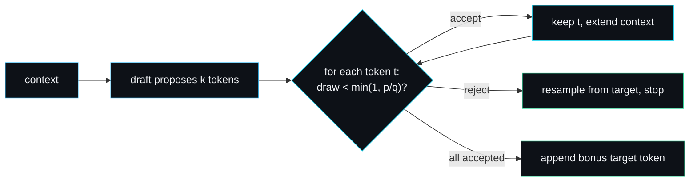

# Speculative Decoding

Speculative decoding makes a single stream decode faster without changing what it produces. This page explains the idea, the acceptance test that keeps it exact, the implementation in `src/speculative.rs`, and the failure modes that the loop has to handle.

## Why decoding is slow

Autoregressive generation is latency bound. Each token requires one forward pass through the target model, and you cannot begin token `n + 1` until you have token `n`. The model is large, the dependency is strict, and so the stream advances one expensive step at a time.

## The idea

Pair the large **target** model with a small, cheap **draft** model. Each round:

1. The draft proposes a run of `k` tokens, decoding them quickly one after another (`draft_run`).
2. The target verifies the whole run.
3. Every draft token the target agrees with is accepted for free. A run where all `k` proposals are accepted yields `k + 1` tokens (the `k` accepted plus one bonus token from the target's verification pass) for the cost of one target step.

The win comes from amortising the target's expensive forward pass over several tokens whenever the cheap draft guesses correctly.



## The acceptance test

The subtlety is keeping the output **exact**: the tokens speculative decoding emits must be distributed identically to plain sampling from the target. forge-infer uses the standard rejection-sampling test from the speculative sampling literature. For each drafted token `t` with draft probability `q(t)` and target probability `p(t)`:

- Accept with probability `min(1, p(t) / q(t))`.
- On the first rejection, stop, resample that one position from the target's distribution, and discard the rest of the draft.

```rust
let accept_prob = if q <= 0.0 { 1.0 } else { (p / q).min(1.0) };
let draw = Self::acceptance_draw(&ctx, pos);
if draw < accept_prob {
    out.push(*tok);                       // accepted, extend context
} else {
    out.push(target_logits.argmax());     // resample this position and stop
    return /* result */;
}
```

This is not an approximation. It is a reorganisation of the same computation that provably preserves the target's output distribution. To keep the engine deterministic and the tests reproducible, the acceptance draw (`acceptance_draw`) is a seeded, context-derived pseudo-random value rather than a thread RNG. The maths is identical; the draw is just repeatable, which is what makes the exactness test below assertable.

## The fully accepted case

If every drafted token is accepted, the target's forward pass over the final context yields a free bonus token, so the round emits `k + 1` tokens:

```rust
let bonus = self.target.forward(&ctx).argmax();
out.push(bonus);
```

The more the draft is right, the more tokens you get per target step, and you never pay more than one target step per round.

## The exactness guarantee, as a test

The most important test is `speculative_output_matches_plain_target_decoding`. With identical draft and target models it generates a sequence speculatively, then generates the same length with plain greedy target decoding, and asserts the two token streams are equal:

```rust
let (spec_tokens, _) = dec.generate(&[1, 2, 3, 4], 12);
// ... plain greedy decode from the target alone ...
assert_eq!(spec_tokens, plain, "speculation must be exact");
```

## Failure modes the loop handles

- **A bad proposal.** When `draw >= accept_prob`, the token is rejected. The decoder resamples that single position from the target's own distribution and discards the remaining drafts, so it never emits a token the target would not. `rejection_falls_back_to_a_target_token` checks it still makes progress (always at least one token).
- **A draft of probability zero.** If `q(t) <= 0` for a drafted token, the ratio `p/q` is undefined; the code treats `accept_prob` as 1, which is the correct limit and keeps the test exact.
- **Early eos.** If an accepted or bonus token is eos, the round returns immediately and `generate` stops the stream.

## Acceptance rate

`SpeculationResult::acceptance_rate()` reports the fraction of drafts accepted in a round, and `generate` returns the aggregate rate across a stream. forge-infer's draft model is built to agree with the target on roughly three contexts in four; `forge-bench` measures an aggregate acceptance rate around 52% on this workload (see [Benchmarks](Benchmarks)), meaning just over half the draft's proposals are reused without a recompute.

## What the tests prove

`full_acceptance_emits_bonus_token`, `speculative_output_matches_plain_target_decoding`, `rejection_falls_back_to_a_target_token`, `a_good_draft_yields_a_high_acceptance_rate`, `acceptance_rate_is_in_range` and `deterministic_across_runs`.

## Lookahead tuning

The `lookahead` parameter is how many tokens the draft proposes per round. Larger lookahead means more tokens per accepted round but more wasted draft work when a rejection comes early. The benchmark uses a lookahead of 4, a common production default.

---
SarmaLinux . sarmalinux.com . [forge-infer repository](https://github.com/sarmakska/forge-infer)
