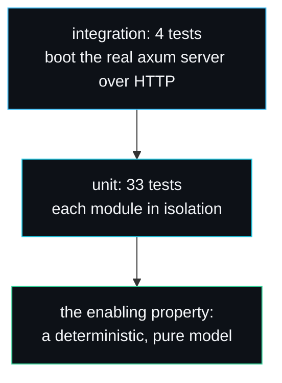

# Testing Strategy

forge-infer has 37 tests: 33 unit tests across the library modules and 4 integration tests that boot the real HTTP server. They run in well under a second with `cargo test` and never flake, because the model is deterministic. This page explains how the tests are organised, what each layer proves, and why determinism is what makes the hard parts testable at all.

## Running the suite

```bash
cargo test                 # all 37 tests
cargo test paged_cache     # one module
cargo test --test server_integration   # just the HTTP tests
```

The breakdown:

| Location | Tests | What they cover |
| --- | --- | --- |
| `src/model.rs` | 4 | determinism, softmax normalisation, pinning, draft/target agreement |
| `src/tokeniser.rs` | 3 | round-trip, eos reservation, single-token decode |
| `src/paged_cache.rs` | 8 | allocate/free, lazy growth, fragmentation bounds, OOB, eviction |
| `src/scheduler.rs` | 8 | admission, batching, preemption, resume, retirement, idle |
| `src/speculative.rs` | 6 | full acceptance, exactness, rejection fallback, rate bounds, determinism |
| `src/engine.rs` | 3 | single request, pressure, determinism |
| `src/server.rs` | 1 | `run_prompt` produces text |
| `tests/server_integration.rs` | 4 | healthz, generate, OpenAI non-streaming, SSE streaming |

## The pyramid



## Why determinism is the whole strategy

A deterministic, pure model is not a convenience here; it is what lets the hard algorithms be tested as facts rather than statistics. Three examples make the point.

**Speculative exactness.** `speculative_output_matches_plain_target_decoding` asserts that speculative decoding with identical draft and target produces exactly the same tokens as plain greedy target decoding, token for token. That assertion is only possible because `p(t)` and `q(t)` are bit-reproducible across model instances; the acceptance draw is a seeded hash, not a thread RNG. With a floating-point attention model this test could only check a distribution, not an equality. This is the single best argument for the deterministic-model decision on [Design-Decisions](Design-Decisions).

**Cache correctness.** Because `forward` is a pure function of the context, the cache can be verified purely on block counts: `allocate_and_free_round_trips` checks that freeing returns every block, `internal_fragmentation_is_bounded_by_block_size` checks the waste bound exactly (`3 * 3` slots for three sequences of 5 tokens at block size 4), and `out_of_blocks_is_reported_and_leaves_state_intact` checks the transactional property. None of these need a model at all.

**Scheduler policy.** The scheduler tests construct a scheduler, submit sequences, call `schedule()`, and assert on the returned `StepPlan`. `preempts_when_blocks_run_out` walks a 6-block, block-size-1 cache to the exact point of pressure and asserts that precisely one sequence is preempted and that it is the least-progressed one. That precision is possible because the scheduler is split from the model (see [Design-Decisions](Design-Decisions)); the test runs with no forward pass.

## What each layer proves

### Model and tokeniser

The lowest layer establishes the properties everything else leans on: `forward_is_deterministic` (same context, same token), `probabilities_sum_to_one` (the softmax `prob_of` is a real distribution), and `draft_and_target_mostly_agree` (the draft is a useful proposer, agreeing on more than 120 of 200 contexts). The tokeniser tests fix the data format: round-trip, eos handling, and that streaming one token at a time reassembles correctly.

### Paged cache

Eight tests cover the allocator's full contract. The most instructive are the two fragmentation tests, which assert the exact properties paging exists to deliver: bounded internal fragmentation, and zero external fragmentation after an interleaved free (`no_external_fragmentation_after_interleaved_free` frees a middle sequence and places a larger one in its blocks, the case a contiguous allocator fails).

### Scheduler

Eight tests cover admission up to the batch cap, decode batching across sequences, the full preempt-and-resume cycle, eos and limit retirement going through the same path, the oversized-prompt rejection, and the idle case. `preempted_sequence_resumes_later` is the end-to-end one: it preempts sequence 2, finishes sequence 1 to free blocks, and asserts sequence 2 is readmitted.

### Speculative decoder

Six tests cover the full-acceptance bonus token, the exactness guarantee, the rejection fallback (always at least one token emitted), the acceptance rate staying in range, that a good draft yields a useful rate (above 0.2), and reproducibility across runs.

### Engine

Three tests drive the loop: one request to completion, ten requests under memory pressure forcing interleaving and preemption (`many_requests_all_complete_under_pressure`), and determinism across two engines.

### Integration

Four async tests in `tests/server_integration.rs` boot the real router on an ephemeral port (`127.0.0.1:0`) and drive it over HTTP with `reqwest`. They check the health probe, the native `/generate` shape, the OpenAI non-streaming response, and the SSE streaming path including the `[DONE]` sentinel and a parse of the first chunk. These are the only tests that touch tokio's runtime and the network stack; they prove the wire format, not just the internals.

## Continuous integration

The repository ships a CI workflow that runs format check, clippy with `-D warnings`, build and test on every push and pull request. To reproduce CI locally:

```bash
cargo fmt --all -- --check
cargo clippy --all-targets -- -D warnings
cargo test
```

The `-D warnings` flag means a clippy lint fails the build, which is why the code carries the occasional `#[allow]`-free idiom and underscore-prefixed unused parameters rather than leaving warnings to accumulate.

## What is not tested, and why

There is no property-based or fuzz testing, because the deterministic model makes the interesting properties checkable as exact equalities instead. There is no load or soak test, because the project is not a production server. There is no test of a real model backend, because the project does not ship one; that is the boundary of the [Writing-a-Model-Backend](Writing-a-Model-Backend) extension.

## See also

- [Design-Decisions](Design-Decisions) for why the model is deterministic.
- [Benchmarks](Benchmarks) for the performance measurements, which are separate from the correctness tests.

---
SarmaLinux . sarmalinux.com . [forge-infer repository](https://github.com/sarmakska/forge-infer)
